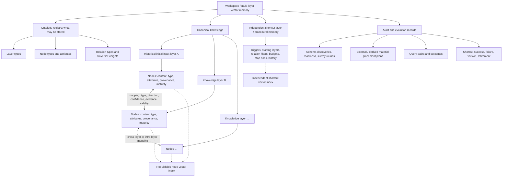
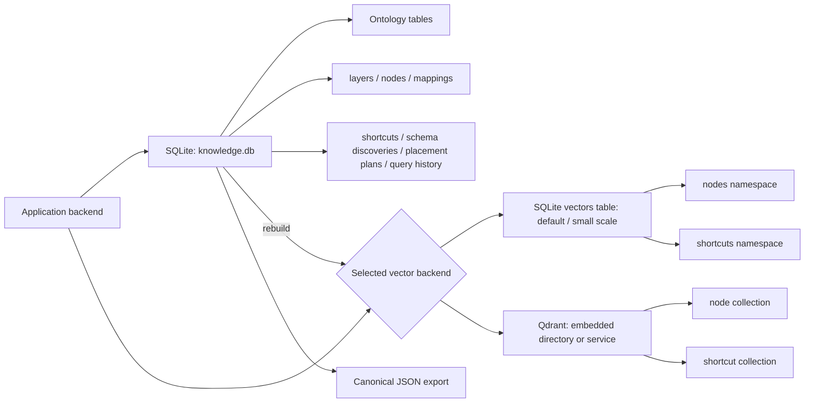
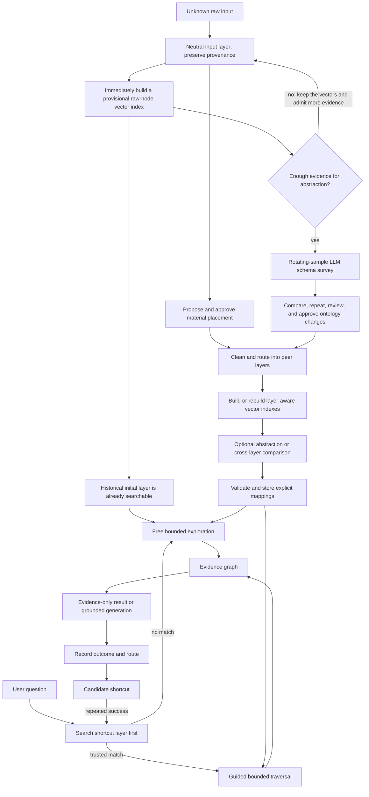

# An Essay Concerning LLM Understanding

*A model-agnostic, domain-extensible multi-layer vector storage and retrieval system with explicit mappings and a peer shortcut layer—its title being a deliberate nod to John Locke.*

[中文说明](README.zh-CN.md) · [Schema discovery](docs/SCHEMA_DISCOVERY.md) · [Abstraction readiness](docs/ABSTRACTION_READINESS.md) · [Research data](research/) · [Scaling study](research/SCALING_STUDY.md) · [Configuration](docs/CONFIGURATION.md) · [Data model and mathematics](docs/DATA_MODEL.md) · [Ontologies](docs/ONTOLOGIES.md)

> **Alpha research software.** The architecture runs and its core invariants are tested, but the current evidence does not establish that layered retrieval is generally faster or more accurate than flat vector search. The repository is published to make that hypothesis testable, not to present it as settled.

## Contents

- [What this repository is](#what-this-repository-is)
- [Install and use it](#install-and-use-it)
- [A working theory of understanding](#a-working-theory-of-understanding)
- [Open domain ontologies](#open-domain-ontologies)
- [Schema discovery before cleaning](#schema-discovery-before-cleaning)
- [How information is stored](#how-information-is-stored)
- [How information moves through the system](#how-information-moves-through-the-system)
- [Mathematical model of multi-layer mapping](#mathematical-model-of-multi-layer-mapping)
- [Architecture and replaceable dependencies](#architecture-and-replaceable-dependencies)
- [What we measured](#what-we-measured)
- [What the present benchmark does not settle](#what-the-present-benchmark-does-not-settle)
- [Open scaling study](#open-scaling-study)
- [Project status and roadmap](#project-status-and-roadmap)
- [Privacy, safety, and epistemic limits](#privacy-safety-and-epistemic-limits)
- [Acknowledgements and legal notices](#acknowledgements-and-legal-notices)

## What this repository is

**This repository is first and foremost an experimental, domain-extensible multi-layer vector storage and retrieval system.** Instead of placing records from different sources, types, and perspectives into one undifferentiated vector layer, it organizes them as peer semantic layers connected by explicit mappings. “Multi-layer” describes the logical organization; an implementation may keep layers in one physical collection with metadata or in several physical collections.

The system is therefore more than a conventional flat vector database with extra labels. Layers remain independently selectable, comparable, traceable, and traversable, while mappings record how individual semantic elements correspond across them.

It is not limited to text interpretation. A node may represent a passage, person, organization, project, decision, risk, metric, event, legal rule, dataset, software service, or another domain-defined unit. Example workspaces include:

- company memory spanning people, projects, decisions, risks, and metrics;
- research memory spanning papers, methods, datasets, findings, and replications;
- legal or policy memory with rules, exceptions, revisions, and validity periods;
- software operations with services, dependencies, owners, deployments, and incidents;
- narrative or philosophical analysis with sources, arguments, events, and competing readings.

The repository provides:

- a FastAPI backend and command-line interface;
- peer knowledge layers with no permanent root layer;
- provenance-preserving nodes and typed cross-layer mappings;
- registries for workspace-defined layer and relation types;
- bounded graph retrieval with depth, breadth, relation, cycle, and information-gain controls;
- a parallel procedural-memory layer of retrieval **shortcuts**;
- shortcut-first routing and candidate-shortcut learning after successful exploration;
- evidence-only operation when no generation model is configured;
- replaceable generation, embedding, vector-store, and document-parser boundaries;
- canonical JSON export independent of the vector index.

## Install and use it

### What is included

The repository contains the application, database schema, built-in SQLite vector index, a deterministic demo embedder, tests, synthetic research results, and benchmark protocol.

It contains **no LLM weights, embedding-model weights, Qdrant server, user documents, or prebuilt knowledge database**.

### Requirements

- Python 3.11 or newer.
- Optional: an OpenAI-compatible generation endpoint, local or online.
- Optional: Sentence Transformers and a model of your choice.
- Optional: Qdrant, either embedded through `qdrant-client` or as a service.
- Optional: Docling for document formats beyond plain text.

### Minimal installation

The minimal configuration needs no model and no external vector database. It uses a low-quality hashing embedder for demonstration and returns an evidence graph instead of a generated answer.

```bash
git clone https://github.com/rsb0328/an-essay-concerning-llm-understanding.git
cd an-essay-concerning-llm-understanding
python -m venv .venv
```

On Windows PowerShell:

```powershell
.\.venv\Scripts\Activate.ps1
pip install -e .
essay-understanding serve
```

On macOS or Linux:

```bash
source .venv/bin/activate
pip install -e .
essay-understanding serve
```

Open `http://127.0.0.1:8765/docs` for the interactive API.

### Production-oriented optional components

```bash
pip install -e ".[sentence-transformers,qdrant,documents]"
cp .env.example .env
```

Choose your own providers:

```env
AEC_LLM_BASE_URL=http://127.0.0.1:1234/v1
AEC_LLM_MODEL=your-model
AEC_LLM_API_KEY=

AEC_EMBEDDING_PROVIDER=sentence_transformers
AEC_EMBEDDING_MODEL=your-embedding-model

AEC_VECTOR_STORE=qdrant
AEC_QDRANT_PATH=./data/qdrant
```

For transparency and reproducibility, the prototype experiments reported below used **Qwen3 14B deployed locally through Ollama** as the generation model, **BAAI/bge-m3** as the embedding model, **embedded Qdrant** as the vector store, and **SQLite** as the canonical structured store. That was the tested experimental configuration—not a required application stack.

This repository does not require Qwen, Ollama, BGE-M3, Qdrant, or a particular hosted API. Users may connect other local models or online services through the provider interfaces. A generation provider only needs to return reliable structured JSON for model-assisted abstraction, relation classification, and grounded answering.

### A first evidence-only query

Create a layer, add text through `/ingest/text`, then query `/query`. The API examples in `/docs` expose the complete schemas. From the terminal:

```bash
essay-understanding ask "How does the text distinguish mapping from identity?" --depth 2
essay-understanding export > memory.json
```

See [configuration](docs/CONFIGURATION.md) for provider examples and [data model](docs/DATA_MODEL.md) for the persistent schema.

Import the company example vocabulary with `essay-understanding ontology-import ontologies/company.example.json`,
or register a workspace-specific ontology through `POST /ontology/import`.

If the dimensions are not known in advance, admit material to an `input` layer and run
`schema-discover NAMESPACE LAYER_ID`, review the pending result, then use `schema-approve` and `schema-clean`.
These model-assisted stages require a generation provider; discovery never activates types by itself.

## A working theory of understanding

The project begins from a modest claim: learning often occurs by establishing a revisable correspondence between new material and structures already available to the learner.

That correspondence is not identity. A useful mapping preserves both resemblance and difference, including the conditions under which an analogy, interpretation, or inference ceases to hold. A contradiction is therefore not merely a retrieval failure. It may indicate a false mapping, an omitted condition, incompatible testimony, or a conceptual boundary that needs revision.

Several design consequences follow:

1. **There is no permanently privileged first layer.** A source can anchor a particular investigation without becoming the metaphysical root of all later understanding.
2. **Perspectives remain distinguishable.** Operational records, human analysis, machine-derived units, source material, and later revision may map to one another without being collapsed into one voice.
3. **Self-derived and externally supplied knowledge are different events.** Machine-produced structure and externally authored information can occupy peer layers while retaining different provenance.
4. **Memory includes procedures as well as propositions.** Repeatedly discovering the same useful route should eventually create a reusable procedural memory rather than force the system to explore from zero.
5. **Understanding develops historically.** Tentative, reinforced, revised, and retired structures should remain auditable instead of being silently overwritten.

This is an implementable memory hypothesis, not a claim that vector mappings are a complete theory of human learning.

## Open domain ontologies

The system does not impose `supports`, `contradicts`, `interprets`, or any other vocabulary on every domain. Each
workspace registers namespaced layer and relation types. A company may use `company:reports_to`,
`company:approved_by`, `company:depends_on`, and `company:risk_to`; philosophy may optionally import
`philosophy:supports` and `philosophy:interprets`.

Openness is governed rather than free-form. Relation definitions declare direction, inverse, symmetry,
transitivity, temporality, allowed endpoint types, traversal weight, and validators. Mappings may also carry open
attributes and validity intervals. Models can select an active relation or propose an unknown namespaced type for
review; an unknown type is never silently persisted. See [Extensible domain ontologies](docs/ONTOLOGIES.md).

## Schema discovery before cleaning

When users do not know the domain structure in advance, material first enters the neutral `input` layer with only minimal normalization and provenance preservation. A bounded LLM survey proposes four distinct kinds of dimension: layer types for independently retrieved or governed contexts, node types for stable semantic units, attributes for descriptive values, and relation types for verifiable links.

Candidates are compared only with active definitions of the same kind and stored as a pending discovery. Exact matches are reused; possible semantic overlaps require explicit selection; nothing is activated by the survey itself. After approval, schema-guided cleaning validates every target layer, node type, attribute, relation, and source pointer before routing derived units into peer layers. See [Schema discovery](docs/SCHEMA_DISCOVERY.md).

Model-assisted abstraction is allowed only after a configurable corpus-size gate (`N ≥ 12` and either `C ≥ 24,000`
characters or `N ≥ 50` short records by default). A new candidate must then repeat across two differently sampled
surveys before activation. These are conservative Alpha defaults, not universal statistical laws. The first input
layer is marked as the historical origin, but the marker creates neither a permanent semantic root nor retrieval
priority. External material gets an auditable placement proposal: same-source continuations may append, independent
sources or viewpoints default to peer layers, and machine abstractions remain in derived layers. See
[Abstraction readiness and material placement](docs/ABSTRACTION_READINESS.md).

## How information is stored

“Library → layers → data inside each layer” is the correct backbone, but not the whole topology. The workspace is a container, not a privileged semantic root. Knowledge layers are peers; nodes belong to layers; mappings cross nodes and layers; the shortcut layer is parallel procedural memory; ontology and audit records govern or describe the content rather than belonging to one knowledge layer.



Physical placement is deliberately split between canonical facts and derived indexes:



Canonical nodes, mappings, ontology, and histories in SQLite are the memory of record. The vector backend contains candidate-retrieval indexes that can be deleted and rebuilt. Qdrant does not own the conceptual data model, and neither model weights nor user source files are shipped in the repository.

## How information moves through the system

The original ideas are implemented as ordinary application logic and data—not as a hidden prompt or a skill inside one particular LLM.



### 1. Neutral admission and schema discovery

Known workspaces may import an ontology directly. Unknown material enters a neutral input layer. Its historically
first input layer is marked `is_initial` for provenance only. Every admitted raw node is embedded immediately into
a provisional index, so the initial layer is searchable even when abstraction readiness fails. The readiness gate
controls only whether a bounded model-assisted schema survey may begin. Proposed layer, node, attribute, and
relation dimensions remain pending.

### 2. Comparison and approval

Candidates are compared with the active registry. Exact matches are reused, possible overlaps are flagged, and
novel candidates must recur across differently sampled surveys before approval. Discovery never changes the
ontology automatically.

### 3. Schema-guided cleaning and peer-layer creation

Approved structure routes bounded raw-node batches into independently selectable peer layers. Every cleaned unit retains explicit raw source IDs; the original input remains canonical evidence.

### 4. Domain-aware normalization

Inputs become domain-appropriate nodes: entities, events, records, measurements, requirements, claims, or passages. Text ingestion may split overlapping passages; other adapters can preserve structured records. The canonical representation remains adapter-independent.

### 5. Replaceable semantic indexing

An embedding provider creates search candidates. Raw nodes receive provisional vectors upon admission; approved
cleaning may then create layer-aware canonical units and their vectors. The model name and vector dimension are
index metadata, not properties of the knowledge itself. Changing embedding models requires a new index, not a new
memory: canonical text, mappings, and shortcut procedures remain available for re-embedding.

### 6. Human-supplied and machine-derived layers

Externally supplied knowledge retains its author, system, and source. A validated placement plan decides whether it
is a same-source continuation, an independent peer layer, link-only material, or unresolved. Model-derived units
remain in a derived layer and link back to exact inputs; they are never written into the historical initial source.

### 7. Candidate comparison

Vector similarity proposes which elements across selected layers are worth comparing. It does not decide that they have any domain relation. This stage reduces the comparison space while remaining relation-agnostic.

### 8. Ontology-constrained relation judgment

Candidate pairs may use only active workspace relations. Direction, endpoint constraints, confidence, evidence, open attributes, validity time, and provenance are preserved. Unknown model-proposed relations remain review proposals; invalid IDs and malformed outputs fail closed rather than silently creating graph edges.

### 9. The independent shortcut layer is queried first

A shortcut is stored in its own canonical table and independent `shortcuts` vector namespace, parallel to domain knowledge layers. It stores trigger examples, starting layers, preferred relation types, depth, breadth, stopping criteria, validators, failure conditions, history, and reliability. It does **not** store a canned answer or live only inside an LLM prompt.

Shortcut selection combines semantic trigger similarity with observed reliability and maturity. A high-confidence match constrains retrieval before graph expansion. A partial or untrusted match must fall back to free exploration.

### 10. Guided or free exploration

When a mature shortcut matches, retrieval begins where the learned route recommends. Otherwise, the system selects semantically relevant layers and seed nodes, then explores mappings. Both paths produce the same evidence-graph format and remain inspectable.

### 11. Association depth and stopping

The user sets a maximum association depth. Each traversal step may cross into another layer through an explicit mapping. Breadth limits the number of new nodes per step; relation filters limit which edges are legal; visited-node tracking prevents cycles; and low information gain can stop exploration before the maximum depth. Depth is therefore a research budget, not an instruction to wander indefinitely.

### 12. Evidence budgeting and grounded synthesis

The evidence graph is ranked and bounded before it reaches a generation model. With no model configured, the graph is the result. With a model configured, answers must cite existing evidence aliases, which are validated and translated back to canonical node IDs. Unsupported or unknown citations are rejected.

### 13. Route observation and shortcut learning

After a successful free exploration, the application summarizes the route as a **candidate** shortcut. Similar successful routes reinforce the candidate; the reference implementation promotes it after repeated confirmation. A mature route records later successes, failures, and latency, and can be retired when it stops helping.

This closes the intended loop:

```text
first encounter → explore → answer → retain the useful route
later similar encounter → retrieve route first → search selectively → update route history
```

### 14. Audit, export, and rebuilding

Queries record requested and reached depth, evidence IDs, shortcut use, latency, and outcome. The ontology registry, schema discoveries, layers, nodes, mappings, and shortcuts export as JSON. Vector stores are excluded because they are reproducible derived indexes.

## Mathematical model of multi-layer mapping

Let layer $L_i$ contain nodes $V_i$. An embedding function $f$ creates search candidates, with initial score:

$$
s_0(v \mid q)=\cos\!\left(f(q),f(v)\right)
$$

An accepted mapping is a property-graph edge $e=(u,v,r,c,a,[t_0,t_1])$: registered relation $r$, confidence $c$, open attributes $a$, and optional validity interval. The ontology supplies traversal weight $w_r$. For path $p=(v_0,e_1,\ldots,e_k)$, the current implementation propagates:

$$
S(p \mid q)=s_0(v_0 \mid q)\prod_{j=1}^{k}
\left(c_{e_j}w_{r_j}\gamma\right),\qquad \gamma=0.88
$$

For a newly reached node, the engine combines its own semantic relevance with the best path score:

$$
R(v \mid q)=0.6\cos\!\left(f(q),f(v)\right)
+0.4\max_{p\to v}S(p \mid q)
$$

Maximum depth, per-step breadth, relation filters, visited-node cycle control, and minimum information gain bound the search. Association depth is therefore an explicit compute budget.

This release implements **typed weighted graph mapping**, not a claimed learned linear transformation $W_{ij}x$ between every pair of vector spaces. Learned projections, contrastive alignment, optimal transport, and graph neural message passing are possible future comparisons, not present capabilities. See [Data model and mathematics](docs/DATA_MODEL.md).

## Architecture and replaceable dependencies

```text
Application-owned core
├── peer layer and provenance model
├── extensible layer/relation ontology registry
├── typed property-mapping model
├── graph traversal and depth controller
├── independent shortcut layer, router, maturity, and history
├── evidence validation
└── canonical import/export

Replaceable adapters
├── GenerationProvider    (any compatible local or online model)
├── Embedder              (hashing demo, Sentence Transformers, API)
├── VectorStore           (built-in SQLite, Qdrant)
└── Document parser       (plain text, optional Docling)
```

SQLite is the default canonical store. The built-in SQLite vector index is useful for installation and small tests; Qdrant is the intended optional backend for serious vector workloads. Neither is allowed to own the conceptual data model.

## What we measured

These measurements come from the earlier local prototype, which used BGE-M3, local Qwen3 14B, SQLite, and embedded Qdrant. The ten questions were synthetic and covered ten different categories. Raw, non-private metrics are in [`research/results`](research/results/).

### Reliability observations

- Core unit tests in the local prototype: 12/12 passed.
- Early repeated full-chain observation: 16 successes in 17 attempts.
- The one failure was truncated answer JSON after the model reached its output cap; the run failed closed and later runs continued.
- Process crashes, timeouts, and cross-run data-pollution events observed: 0.
- Later architecture comparison: 30/30 mode queries completed.

These are observations, not proof of a zero or 5.9% population failure rate. Seventeen attempts are far too few for a tight reliability estimate.

The independent public package includes isolated core tests and a 100-node scaling smoke test across all three modes, but that smoke test is explicitly too small to support an architecture claim.

### Flat, layered, and layered-plus-procedure comparison

Each of ten questions ran once in each mode, for 30 queries total.

| Metric | Flat single layer | Layered | Layered + shortcut layer |
|---|---:|---:|---:|
| Success rate | 100% | 100% | 100% |
| Mean total latency | 5.908 s | 8.386 s | 6.757 s |
| P95 total latency | 9.274 s | 15.086 s | 12.503 s |
| Mean answer-generation latency | 5.835 s | 6.133 s | 4.330 s |
| Gold-answer embedding similarity | 0.805810 | 0.805606 | 0.806572 |
| Mean claim coverage | 0.642034 | 0.641771 | 0.650433 |
| Mean citation/evidence alignment | 0.770266 | 0.795861 | 0.844410 |
| Mean evidence nodes | 8.0 | 17.2 | 11.5 |
| Mean layer diversity | 1.0 | 4.2 | 3.4 |

The honest conclusion is limited:

- unrestricted layered retrieval was about 44% slower and did not measurably improve answer similarity or claim coverage;
- it did expose more layers and improved citation/evidence alignment modestly;
- the earlier procedural-route prototype reduced answer-generation time by about 25.8% and improved citation alignment, but end-to-end latency remained about 14.4% above the flat mean;
- the skill itself was cheap after vector reuse, but that prototype looked it up **after** full graph retrieval.

This open-source version changes the order to shortcut-first. It has unit tests for that ordering, but it has not yet been subjected to the same model-backed benchmark. The old results must not be presented as evidence that the new ordering is already faster.

## What the present benchmark does not settle

Ten synthetic questions on one workstation cannot determine whether the architecture wins at scale. It may remain slower for ordinary factual question answering. Its more plausible value may instead lie in dimensions a flat-answer benchmark only partially measures:

- keeping domain records, sources, machine-derived units, and competing perspectives distinct;
- preserving conflicts, temporal changes, and validity boundaries rather than averaging them away;
- tracking how a knowledge structure was revised;
- learning procedural routes across repeated related investigations;
- exposing a query's path for audit and correction;
- supporting long-term, personalized memory without declaring one permanent root.

These are hypotheses about useful memory organization. They do not demonstrate consciousness, subjective experience, or human-like understanding. The system may support experiments about memory, metacognition, self-revision, and procedural learning without settling the philosophical question of machine consciousness.

## Open scaling study

Hardware cost and local inference time prevented a large controlled study. We especially want to know how the three architectures behave as memory grows from thousands to millions of nodes, and whether a warmed-up shortcut layer eventually repays its learning and routing overhead.

The proposed study specifies logarithmic scale points, cold and warm runs, latency percentiles, throughput, recall, claim coverage, grounding, shortcut false-route rate, information depth, memory use, and hardware disclosure. See [the complete scaling protocol](research/SCALING_STUDY.md) and the [reproducible benchmark entry point](benchmarks/).

Contributions with negative or null results are welcome. A useful outcome is a curve showing *where the architecture stops helping*, not only a demonstration designed to make it win.

## Project status and roadmap

Implemented in this open-source package:

- model-free evidence mode;
- peer layers, nodes, provenance, and mappings;
- model-independent transformation and ontology-constrained relation protocols;
- extensible layer and relation registries with company and philosophy example packs;
- pre-cleaning schema discovery, overlap triage, approval, and schema-guided multi-layer routing;
- depth/breadth/relation/cycle/information-gain traversal controls;
- shortcut-first routing;
- candidate shortcut creation, reinforcement, activation, and use history;
- built-in and optional provider adapters;
- canonical export and isolated tests.

Important next work:

- evaluate shortcut-first retrieval with the same controlled dataset;
- add candidate-shortcut editing, explicit rejection, retirement, and route version comparison;
- add model-assisted shortcut descriptions without giving the model authority to activate them;
- implement richer import/export and document parsing adapters;
- build a local user interface;
- add statistically useful real-world corpora and human evaluation;
- collect multi-scale community benchmarks.

## Privacy, safety, and epistemic limits

- Local databases, vector indexes, uploaded sources, model caches, and `.env` files are ignored by Git.
- Do not publish copyrighted or confidential inputs merely because their vectors were generated locally.
- Online generation or embedding providers receive the text sent to their APIs; local operation is required for material that must not leave the machine.
- A shortcut can reproduce a bad route. Candidate maturity, reliability, validators, failure conditions, and fallback exploration reduce this risk but do not eliminate it.
- Similarity is not truth, mapping is not identity, and graph depth is not understanding.

Security reports should follow [SECURITY.md](SECURITY.md).

## Acknowledgements and legal notices

The project benefited from the work of:

- [FastAPI](https://github.com/fastapi/fastapi) and [Pydantic](https://github.com/pydantic/pydantic) for the API and validation layer;
- [NumPy](https://github.com/numpy/numpy) for numerical operations;
- [Sentence Transformers](https://github.com/huggingface/sentence-transformers) for optional local embedding execution;
- [Qdrant](https://github.com/qdrant/qdrant) and its Python client for optional vector storage;
- [Docling](https://github.com/docling-project/docling) for optional document conversion;
- the creators of [BGE-M3](https://huggingface.co/BAAI/bge-m3) and [Qwen3](https://github.com/QwenLM/Qwen3), which were used in the local prototype experiments but are not bundled or required here.

This repository is licensed under Apache License 2.0. Third-party components and models retain their own licenses. See [THIRD_PARTY_NOTICES.md](THIRD_PARTY_NOTICES.md). No model weights or third-party installers are redistributed.

## Citation

If you use the project or extend the scaling study, cite the repository using [`CITATION.cff`](CITATION.cff) and include your exact model, vector store, hardware, and configuration with reported results.
