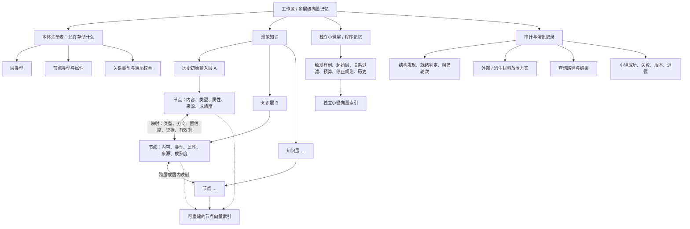
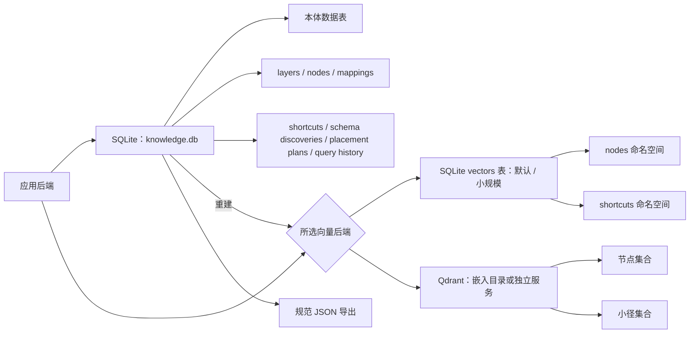
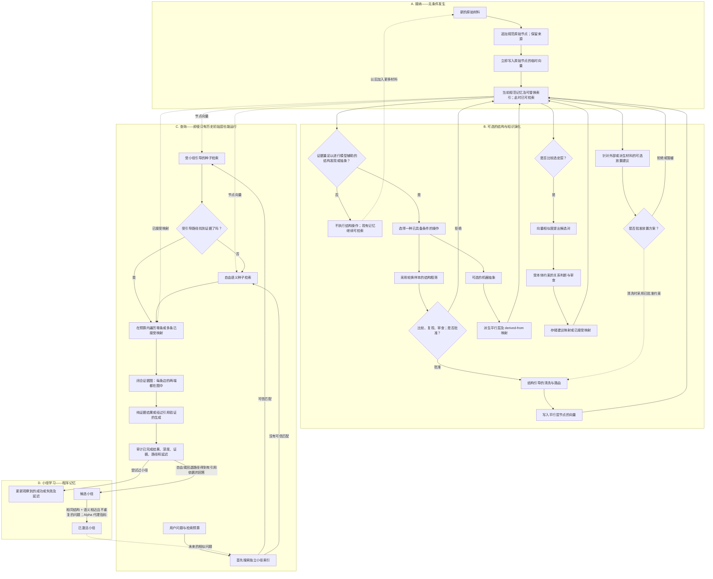

# 论大语言模型之理解

*一个可替换嵌入提供方、可扩展到不同领域的多层级向量存储与检索系统，具有显式映射和一个平行的小径层——项目名称特意向约翰·洛克致意。*

[English README](README.md) · [结构发现](docs/SCHEMA_DISCOVERY.md) · [抽象就绪条件](docs/ABSTRACTION_READINESS.md) · [研究数据](research/) · [规模扩展研究](research/SCALING_STUDY.md) · [配置](docs/CONFIGURATION.md) · [数据模型与数学说明](docs/DATA_MODEL.md) · [本体](docs/ONTOLOGIES.md)

> **Alpha 阶段的研究软件。** 当前架构可以运行，核心不变量也经过测试，但现有证据并不能证明多层级检索普遍比单层向量检索更快或更准确。公开这个仓库是为了让这一假说能够被检验，而不是把它当作已经确定的结论。

## 目录

- [这个仓库是什么](#这个仓库是什么)
- [安装与使用](#安装与使用)
- [一种关于理解的工作假说](#一种关于理解的工作假说)
- [开放的领域本体](#开放的领域本体)
- [清洗前的结构发现](#清洗前的结构发现)
- [信息如何存储](#信息如何存储)
- [信息如何在系统中流动](#信息如何在系统中流动)
- [多层级映射的数学模型](#多层级映射的数学模型)
- [架构与可替换依赖](#架构与可替换依赖)
- [我们测量了什么](#我们测量了什么)
- [当前基准尚不能回答什么](#当前基准尚不能回答什么)
- [开放的规模扩展研究](#开放的规模扩展研究)
- [项目状态与路线图](#项目状态与路线图)
- [隐私、安全与认识论边界](#隐私安全与认识论边界)
- [致谢与法律声明](#致谢与法律声明)

## 这个仓库是什么

**这个仓库首先是一个实验性的、可扩展到不同领域的多层级向量存储与检索系统。** 它不把来自不同来源、类型和视角的记录全部放入一个不加区分的向量层，而是将它们组织成由显式映射连接的平行语义层。“多层级”描述的是逻辑组织方式；具体实现既可以用元数据把各层保存在一个物理集合中，也可以使用多个物理集合。

因此，它不只是一个额外加了标签的传统单层向量数据库。各层仍能被独立选择、比较、追溯和遍历，而映射会记录各个语义元素如何跨层对应。

它并不局限于文本解读。一个节点可以表示段落、人物、组织、项目、决策、风险、指标、事件、法律规则、数据集、软件服务或其他由领域定义的单元。示例工作区包括：

- 跨越人员、项目、决策、风险和指标的公司记忆；
- 跨越论文、方法、数据集、研究结果和复现实验的研究记忆；
- 包含规则、例外、修订和有效期的法律或政策记忆；
- 包含服务、依赖、负责人、部署和事故的软件运维记忆；
- 包含原始资料、论证、事件和竞争性解读的叙事或哲学分析。

本仓库提供：

- FastAPI 后端和命令行界面；
- 没有永久根层的平行知识层；
- 保留来源的节点和带类型的跨层映射；
- 由工作区定义的层类型与关系类型注册表；
- 具有深度、宽度、关系、循环和信息增益控制的有界图检索；
- 与知识层平行的检索程序记忆——**小径层**；
- 小径优先路由，以及有引用依据的探索之后进行语义候选小径学习；
- 未配置生成模型时的纯证据运行模式；
- 可替换的生成、嵌入、向量存储和文档解析边界；
- 独立于向量索引的规范 JSON 导出。

## 安装与使用

### 仓库包含什么

仓库包含应用程序、数据库结构、内置 SQLite 向量索引、确定性的演示嵌入器、测试、合成研究结果和基准测试协议。

仓库**不包含任何 LLM 权重、嵌入模型权重、Qdrant 服务端、用户文档或预构建知识数据库**。

### 环境要求

- Python 3.11 或更高版本。
- 可选：本地或在线、兼容 OpenAI 接口的生成端点。
- 可选：Sentence Transformers 和你选择的模型。
- 可选：通过 `qdrant-client` 嵌入运行或作为服务运行的 Qdrant。
- 可选：用于纯文本以外文档格式的 Docling。

### 最小安装

最小配置不需要任何模型或外部向量数据库。它使用一个低质量的哈希嵌入器进行演示，并返回证据图，而不是生成式答案。

```bash
git clone https://github.com/rsb0328/an-essay-concerning-llm-understanding.git
cd an-essay-concerning-llm-understanding
python -m venv .venv
```

Windows PowerShell：

```powershell
.\.venv\Scripts\Activate.ps1
pip install -e .
essay-understanding serve
```

macOS 或 Linux：

```bash
source .venv/bin/activate
pip install -e .
essay-understanding serve
```

打开 `http://127.0.0.1:8765/docs` 即可使用交互式 API。

### 面向正式使用的可选组件

```bash
pip install -e ".[sentence-transformers,qdrant,documents]"
cp .env.example .env
```

选择你自己的服务提供方：

```env
AEC_LLM_BASE_URL=http://127.0.0.1:1234/v1
AEC_LLM_MODEL=your-model
AEC_LLM_API_KEY=

AEC_EMBEDDING_PROVIDER=sentence_transformers
AEC_EMBEDDING_MODEL=your-embedding-model

AEC_VECTOR_STORE=qdrant
AEC_QDRANT_PATH=./data/qdrant
```

为了保证透明性和可复现性，下文所报告的原型实验使用了**通过 Ollama 在本地部署的 Qwen3 14B**作为生成模型、**BAAI/bge-m3** 作为嵌入模型、**嵌入式 Qdrant** 作为向量存储，并以 **SQLite** 作为规范结构化存储。这只是经过测试的实验配置，并不是应用程序的强制技术栈。

本仓库不要求使用 Qwen、Ollama、BGE-M3、Qdrant 或某一种托管 API。用户可以通过提供方接口接入其他本地模型或在线服务。生成提供方只需要能够可靠地返回结构化 JSON，以支持模型辅助的抽象、关系分类和有证据约束的回答。

### 第一次纯证据查询

创建一个层，通过 `/ingest/text` 添加文本，然后查询 `/query`。`/docs` 中的 API 示例展示了完整的数据结构。也可以从终端执行：

```bash
essay-understanding ask "How does the text distinguish mapping from identity?" --depth 2
essay-understanding export > memory.json
```

服务提供方示例见[配置说明](docs/CONFIGURATION.md)，持久化结构见[数据模型](docs/DATA_MODEL.md)。

可以使用 `essay-understanding ontology-import ontologies/company.example.json` 导入公司示例词汇，或通过 `POST /ontology/import` 注册特定工作区的本体。

如果事先不知道数据维度，可以先把材料接纳到 `input` 层，运行 `schema-discover NAMESPACE LAYER_ID`，审查待处理结果，然后执行 `schema-approve` 和 `schema-clean`。这些模型辅助阶段需要生成提供方；结构发现绝不会自行激活类型。

## 一种关于理解的工作假说

项目从一个克制的主张出发：学习往往发生于学习者在新材料与已有结构之间建立一种可修订的对应关系之时。

这种对应并不等同于同一性。有用的映射既要保留相似，也要保留差异，包括类比、解读或推理在什么条件下不再成立。因此，矛盾不一定只是检索失败。它可能表明映射错误、遗漏了条件、证言彼此不相容，或者某个概念边界需要修订。

由此产生几个设计结论：

1. **不存在永久享有特权的第一层。** 某个来源可以成为一次具体研究的锚点，但不会因此成为所有后续理解的形而上学根基。
2. **不同视角保持可区分。** 业务记录、人类分析、机器派生单元、原始资料和后续修订可以彼此映射，而不被压缩成同一个声音。
3. **自行派生的知识与外部提供的知识是不同事件。** 机器产生的结构和外部作者提供的信息可以处于平行层，同时保留不同来源。
4. **记忆既包括命题，也包括程序。** 如果系统反复发现同一条有用路径，它最终应形成可复用的程序记忆，而不是每次都从零开始探索。
5. **理解具有历史发展过程。** 暂定、强化、修订和退役的结构都应可审计，而不应被静默覆盖。

这是一种可以实现的记忆假说，而不是声称向量映射已经构成了关于人类学习的完整理论。

## 开放的领域本体

系统不会把 `supports`、`contradicts`、`interprets` 或任何其他词汇强加给所有领域。每个工作区都注册带命名空间的层类型和关系类型。公司工作区可以使用 `company:reports_to`、`company:approved_by`、`company:depends_on` 和 `company:risk_to`；哲学工作区则可以选择导入 `philosophy:supports` 和 `philosophy:interprets`。

这种开放性受到规则治理，而不是任意自由书写。关系定义会声明方向、逆关系、对称性、传递性、时间性、允许的端点类型、遍历权重和验证器。映射还可以携带开放属性与有效时间区间。模型可以选择一个已激活关系，也可以提出一个未知的、带命名空间的类型供人工审查；未知类型绝不会被静默写入。当前检索会执行方向、对称性和可选的查询时点有效性约束；传递性仍只是注册表元数据，本版本不会推断或物化传递闭包。详见[可扩展领域本体](docs/ONTOLOGIES.md)。

## 清洗前的结构发现

当用户事先不知道领域结构时，材料首先进入中性的 `input` 层，只做最小规范化并保留来源。一次有界的 LLM 粗筛会提出四类彼此不同的维度：用于独立检索或治理语境的层类型、用于稳定语义单元的节点类型、用于描述性数值的属性，以及用于可验证连接的关系类型。

候选项只会和同类的已激活定义比较，并保存为待处理的结构发现。完全匹配会被复用；可能发生语义重叠的项目需要明确选择；粗筛本身不会激活任何内容。经过批准后，结构引导清洗会验证每一个目标层、节点类型、属性、关系和来源指针，再把派生单元路由到平行层中。详见[结构发现](docs/SCHEMA_DISCOVERY.md)。

只有达到可配置的语料规模门槛后，才允许模型辅助抽象（默认要求 `N ≥ 12` 且字符数 `C ≥ 24,000`，或者短记录数量 `N ≥ 50`）。一个新候选还必须在两轮轮换样本粗筛中重复出现，之后才可激活。这只是降低采样方差的“重复出现门控”，不是独立采样或统计检验，也不能控制模型共有偏差。第一个输入层会被标记为历史起源，但这个标记不会建立永久语义根层，也不会给予检索优先级。外部材料会得到一份可审计的放置建议：同一来源的延续内容可以追加；独立来源或视角默认创建平行层；机器抽象始终留在派生层。详见[抽象就绪条件与材料放置](docs/ABSTRACTION_READINESS.md)。

## 信息如何存储

“库 → 层 → 层内数据”是正确的骨架，但不是完整拓扑。工作区是容器，而不是享有特权的语义根。知识层彼此平行；节点属于各层；映射跨越节点和层；小径层是平行的程序记忆；本体和审计记录负责治理或描述内容，并不属于某一个知识层。



物理存储有意区分为规范事实和派生索引：



SQLite 中的规范节点、映射、本体和历史记录才是正式记忆。向量后端只保存可以删除并重建的候选检索索引。Qdrant 不拥有概念数据模型，仓库也不附带模型权重或用户原始文件。

## 信息如何在系统中流动

最初的思想以普通应用程序逻辑和数据实现，而不是作为某个特定 LLM 内的隐藏提示词或技能存在。下图有意拆分成四个彼此作用的生命周期：接纳、可选的知识演化、查询和小径学习。它们并不是一条所有数据都必须走完的线性流水线。



### 1. 中性接纳与结构发现

结构已知的工作区可以直接导入本体。未知材料进入中性输入层。其历史上的第一个输入层标记为 `is_initial`，只用于来源追踪。每个被接纳的原始节点都会立即嵌入临时索引；所以即使没有达到抽象门槛，初始层也已经可以检索。就绪门槛只控制是否可以启动有界的模型辅助结构粗筛。建议的层、节点、属性和关系维度都保持待处理状态。

### 2. 比较与批准

候选项会与已激活注册表比较。完全匹配的定义会被复用，可能重叠的定义会被标记，而新候选必须在采用不同样本的粗筛中重复出现，之后才可批准。结构发现绝不会自动改变本体。

### 3. 结构引导清洗与平行层创建

获批的结构会把有界批次的原始节点路由到可以独立选择的平行层中。每个清洗单元都保留明确的原始来源 ID；最初输入仍是规范证据。

### 4. 领域感知的规范化

输入会变成适合相应领域的节点：实体、事件、记录、测量、要求、主张或段落。文本接纳可以切分带有重叠的段落；其他适配器可以保留结构化记录。规范表示始终与具体适配器无关。

### 5. 可替换的语义索引

嵌入提供方负责生成检索候选。原始节点在接纳时立即获得临时向量；批准清洗后，系统还可以创建带有层信息的规范单元及其向量。模型名称和向量维度属于索引元数据，不属于知识本身。更换嵌入模型需要建立新索引，而不是建立新记忆：规范文本、映射和小径程序仍可用于重新嵌入。

### 6. 人类提供层与机器派生层

外部提供的知识会保留其作者、系统和来源。经过验证的放置方案决定它属于同一来源的延续、独立平行层、仅建立链接的材料，还是尚未解决。模型派生单元始终位于派生层，并链接回精确输入；它们绝不会被写回历史初始来源。

### 7. 候选比较

向量相似度只负责提出所选层中哪些元素值得跨层比较。它并不判定这些元素具有某种领域关系。这个阶段在不预设关系的前提下缩小比较空间。

### 8. 受本体约束的关系判断

候选对只能使用工作区中已激活的关系。方向、端点约束、置信度、证据、开放属性、有效时间和来源都会得到保留。模型提出的未知关系仍只是待审建议；无效 ID 或格式错误的输出会安全失败，而不会静默创建图边。建议状态的映射可以保存以供审查，但检索只遍历状态为 `accepted` 的映射。

### 9. 首先查询独立小径层

小径保存在独立的规范数据表和独立的 `shortcuts` 向量命名空间中，与领域知识层平行。它保存触发样例、起始层、偏好的关系类型、深度、宽度、停止条件、验证器、失败条件、历史和可靠性。它**不保存预制答案，也不只存在于 LLM 提示词中**。

小径选择会综合语义触发相似度、已观察到的可靠性和成熟度，并选择超过阈值的最高综合分。图扩展前，系统先用一小组全局候选检查小径起始层是否合理；预检失败会跳过受引导遍历，并复用这批候选完成回退。假路线状态及其浪费的延迟会进入返回值和审计记录，而不是被隐藏。

### 10. 受引导或自由探索

当成熟小径匹配时，检索会从已学习路径建议的位置开始。否则，系统会先选择语义相关的层和种子节点，再沿映射探索。两条路径都产生相同格式、可检查的证据图。

### 11. 联想深度与停止

用户设置最大联想深度。每次遍历都可以通过一个显式映射进入另一层。宽度限制每一步产生的新节点数；关系过滤、方向和可选的 `as_of` 有效时点限制哪些边合法；已访问节点追踪防止循环；较低的信息增益可以让探索在最大深度之前提前停止。信息增益会依据当前问题的初始分数分布归一化，而不是依赖某个嵌入模型绑定的固定余弦阈值。因此，深度是一项研究预算，而不是让系统无限游荡的命令。

### 12. 证据预算与有依据的综合

证据图经过排序和限量后才会送入生成模型。未配置模型时，证据图本身就是结果。配置模型后，答案必须引用现有证据别名；系统会验证别名并将其转换回规范节点 ID。不受支持或未知的引用会被拒绝。

### 13. 路径观察与小径学习

只有当自由探索或回退探索产生至少带有一个有效引用的有依据回答时，应用程序才会把路径总结为一条**候选**小径。强化同时要求路线结构相同、问题语义相近且不是重复问题。结构相同但语义无关的问题会形成不同候选；重复同一句问题不会提高成熟度。Alpha 参考实现在三次不同且有依据的观察后将其提升为成熟小径。这仍只是程序有效性的代理指标，不能证明每个被引用主张都为真。仅证据模式不会自动学习小径。明确的用户评价、通用验证器执行和自动退役仍属于后续工作。

这就形成了预期的循环：

```text
首次遇到 → 探索 → 回答 → 保留有用路径
以后遇到相似问题 → 先检索路径 → 选择性搜索 → 更新路径历史
```

### 14. 审计、导出与重建

已完成查询会记录请求深度、实际到达深度、证据 ID、小径使用、延迟和结果。生成验证失败也会先记录为失败运行，再把错误返回给调用方。本体注册表、结构发现、层、节点、映射和小径均可导出为 JSON。向量存储不在导出范围内，因为它属于可以复现的派生索引；可用 `essay-understanding reindex` 或 `POST /indexes/rebuild` 根据 SQLite 中的规范记录重建当前模型的节点和小径向量。

## 多层级映射的数学模型

设层 $L_i$ 包含节点 $V_i$。嵌入函数 $f$ 生成检索候选，其初始分数为：

$$
s_0(v \mid q)=\cos\!\left(f(q),f(v)\right)
$$

经过确认的映射是一条属性图边 $e=(u,v,r,c,a,[t_0,t_1])$：其中 $r$ 是已注册关系，$c$ 是置信度，$a$ 是开放属性，$[t_0,t_1]$ 是可选有效时间区间。本体提供遍历权重 $w_r$。对路径 $p=(v_0,e_1,\ldots,e_k)$，当前实现按下式传播：

$$
S(p \mid q)=s_0(v_0 \mid q)\prod_{j=1}^{k}
\left(c_{e_j}w_{r_j}\gamma\right)
$$

到达一个新节点后，引擎把节点自身的语义相关性与最佳路径分数结合：

$$
R(v \mid q)=\alpha\cos\!\left(f(q),f(v)\right)
+(1-\alpha)\max_{p\to v}S(p \mid q)
$$

`alpha` 和 `gamma` 是路线计划参数（Alpha 默认值为 `0.6` 和 `0.88`），不是学习得到的常数。为避免把停止逻辑绑定到某个嵌入模型，系统会用当前问题初始候选的中位数到最大值区间归一化新节点语义分数。最大深度、每步宽度、关系过滤、方向、有效时点、已访问节点循环控制和最低归一化信息增益共同限制搜索。遍历会读取索引中已有的节点向量；只有索引项缺失时才重新嵌入并修复。因此，联想深度是一项明确的计算预算。

当前版本实现的是**带类型、带权重的图映射**，并没有声称已经学习出每一对向量空间之间的线性变换 $W_{ij}x$。学习投影、对比对齐、最优传输和图神经消息传递都可以作为未来比较方向，但不是当前功能。详见[数据模型与数学说明](docs/DATA_MODEL.md)。

## 架构与可替换依赖

```text
应用程序拥有的核心
├── 平行层与来源模型
├── 可扩展的层 / 关系本体注册表
├── 带类型的属性映射模型
├── 图遍历与深度控制器
├── 独立小径层、路由器、成熟度和历史
├── 证据验证
└── 规范导入 / 导出

可替换适配器
├── GenerationProvider    （任意兼容的本地或在线模型）
├── Embedder              （哈希演示、Sentence Transformers、API）
├── VectorStore           （内置 SQLite、Qdrant）
└── Document parser       （纯文本、可选 Docling）
```

SQLite 是默认规范存储。内置 SQLite 向量索引适合安装验证和小规模测试；Qdrant 是面向严肃向量工作负载的可选后端。二者都不能拥有概念数据模型。

## 我们测量了什么

以下测量来自较早的本地原型，它使用了 BGE-M3、本地 Qwen3 14B、SQLite 和嵌入式 Qdrant。十个问题是合成问题，覆盖十个不同类别。非私密的原始指标位于 [`research/results`](research/results/)。

### 可靠性观察

- 本地原型核心单元测试：12/12 通过。
- 早期重复全链路观察：17 次尝试中成功 16 次。
- 唯一一次失败是模型达到输出上限后答案 JSON 被截断；该次运行安全失败，之后的运行可以继续。
- 观察到的进程崩溃、超时和跨运行数据污染事件：0。
- 后续架构对比：30/30 个模式查询完成。

这些只是观察结果，既不能证明总体失败率为零，也不能证明它是 5.9%。十七次尝试远不足以得出精确的可靠性估计。

独立发布的软件包包含彼此隔离的核心测试，以及一个在三种模式下运行的 100 节点规模冒烟测试；但这个冒烟测试显然太小，不能用来支持任何架构优势结论。

### 单层、多层和多层加程序记忆对比

十个问题分别在三种模式下各运行一次，共 30 次查询。

| 指标 | 单一平面层 | 多层 | 多层 + 小径层 |
|---|---:|---:|---:|
| 成功率 | 100% | 100% | 100% |
| 平均总延迟 | 5.908 秒 | 8.386 秒 | 6.757 秒 |
| P95 总延迟 | 9.274 秒 | 15.086 秒 | 12.503 秒 |
| 平均答案生成延迟 | 5.835 秒 | 6.133 秒 | 4.330 秒 |
| 与标准答案的嵌入相似度 | 0.805810 | 0.805606 | 0.806572 |
| 平均主张覆盖率 | 0.642034 | 0.641771 | 0.650433 |
| 平均引用 / 证据一致度 | 0.770266 | 0.795861 | 0.844410 |
| 平均证据节点数 | 8.0 | 17.2 | 11.5 |
| 平均层多样性 | 1.0 | 4.2 | 3.4 |

诚实的结论十分有限：

- 不受限制的多层检索约慢 44%，且没有可测量地提高答案相似度或主张覆盖率；
- 它确实展示了更多层，并小幅提高了引用 / 证据一致度；
- 早期程序路径原型将答案生成时间缩短约 25.8%，并改善了引用一致度，但端到端延迟仍比单层平均值高约 14.4%；
- 向量复用之后，技能自身的开销很低，但该原型是在完整图检索**之后**才查询技能。

这个开源版本把顺序改为小径优先。它拥有验证该顺序的单元测试，但尚未接受相同的模型支持基准测试。旧结果不能被当作新顺序已经更快的证据。

## 当前基准尚不能回答什么

在一台工作站上运行十个合成问题，无法判断这种架构能否在规模扩大时取得优势。对于普通事实问答，它可能始终更慢。它更可能具有价值的方面，也许是单一答案基准只能部分测量的维度：

- 将领域记录、来源、机器派生单元和竞争性视角彼此区分；
- 保留冲突、时间变化和有效性边界，而不是将它们平均掉；
- 追踪知识结构如何被修订；
- 在反复进行的相关研究中学习程序路径；
- 暴露查询路径，以便审计和纠正；
- 支持长期、个性化记忆，同时不宣布某一层为永久根层。

这些是关于有用记忆组织方式的假说。它们不能证明意识、主观体验或类似人类的理解。该系统可以支持关于记忆、元认知、自我修订和程序学习的实验，但无法单独解决机器意识这一哲学问题。

## 开放的规模扩展研究

受硬件成本和本地推理时间限制，我们未能进行大规模受控研究。我们尤其想知道：当记忆从数千节点增长到数百万节点时，三种架构各自会如何变化；经过预热的小径层能否最终抵偿它的学习和路由开销。

建议的研究规定了对数尺度的数据点、冷启动与热启动运行、延迟百分位数、吞吐量、召回率、主张覆盖率、证据落地程度、小径错误路由率、信息深度、内存使用量和硬件披露。另有一份[可证伪的视角保留评测协议](research/PERSPECTIVE_PRESERVATION_BENCHMARK.md)，要求以带元数据过滤的强单层基线为对照，客观评估矛盾双方召回、视角归属、错误调和、时间有效性与修订链。详见[完整规模扩展协议](research/SCALING_STUDY.md)和[可复现基准入口](benchmarks/)。

我们欢迎负面或无显著差异的结果。有价值的结果是一条显示“架构从哪里开始不再有帮助”的曲线，而不只是为了让它获胜而设计的演示。

## 项目状态与路线图

此开源软件包已经实现：

- 无模型纯证据模式；
- 平行层、节点、来源和映射；
- 与提供方解耦的转换协议和受本体约束的关系协议；
- 可扩展的层与关系注册表，以及公司和哲学示例包；
- 清洗前结构发现、重叠分流、批准和结构引导的多层路由；
- 深度 / 宽度 / 关系 / 循环 / 信息增益遍历控制；
- 小径优先路由；
- 有引用依据且带语义约束的候选小径创建、强化、激活、假路线遥测和使用历史；
- 内置及可选的提供方适配器；
- 规范导出和隔离测试。

重要的后续工作：

- 用相同受控数据集评估小径优先检索；
- 增加候选小径编辑、明确拒绝、退役和路径版本比较；
- 增加模型辅助的小径描述，但不赋予模型激活它们的权力；
- 增加明确的用户结果反馈、执行小径验证器并实现自动退役策略；
- 实现更丰富的导入 / 导出和文档解析适配器；
- 构建本地用户界面；
- 增加具有统计意义的真实语料和人工评估；
- 收集多尺度社区基准测试。

## 隐私、安全与认识论边界

- 本地数据库、向量索引、上传来源、模型缓存和 `.env` 文件均被 Git 忽略。
- 不要仅仅因为向量是在本地生成的，就发布受版权保护或机密的输入材料。
- 在线生成或嵌入提供方会收到发送给其 API 的文本；必须留在本机的材料需要采用本地运行方式。
- 小径可能重复一条错误路径。语义强化、不同且有依据的观察、全局预检、假路线遥测和回退可以降低这种风险，但不能消除风险。除引用依据验证外，验证器和失败条件仍作为程序元数据保存，尚没有通用策略引擎去执行它们。
- 相似不等于真实，映射不等于同一，图深度也不等于理解。

安全问题请遵循 [SECURITY.md](SECURITY.md)。

## 致谢与法律声明

本项目受益于以下工作：

- [FastAPI](https://github.com/fastapi/fastapi) 和 [Pydantic](https://github.com/pydantic/pydantic)：API 与验证层；
- [NumPy](https://github.com/numpy/numpy)：数值计算；
- [Sentence Transformers](https://github.com/huggingface/sentence-transformers)：可选的本地嵌入执行；
- [Qdrant](https://github.com/qdrant/qdrant) 及其 Python 客户端：可选向量存储；
- [Docling](https://github.com/docling-project/docling)：可选文档转换；
- [BGE-M3](https://huggingface.co/BAAI/bge-m3) 和 [Qwen3](https://github.com/QwenLM/Qwen3) 的创建者：二者用于本地原型实验，但既不捆绑在仓库中，也不是运行要求。

本仓库采用 Apache License 2.0。第三方组件和模型仍适用各自许可证。详见 [THIRD_PARTY_NOTICES.md](THIRD_PARTY_NOTICES.md)。本仓库不分发任何模型权重或第三方安装程序。

## 引用

如果你使用本项目或扩展规模研究，请通过 [`CITATION.cff`](CITATION.cff) 引用本仓库，并在报告结果时附上准确的模型、向量存储、硬件和配置。
