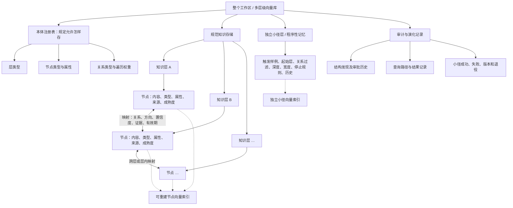
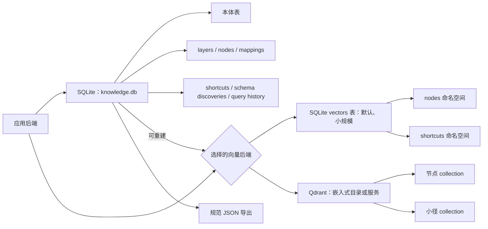

# 论大语言模型之理解

**An Essay Concerning LLM Understanding 是一个模型无关、领域开放的多层级向量存储与检索系统。** 它把不同来源、类型和视角的信息保存在可独立选择的平行层中，以显式映射连接其中的元素，并把过去成功的检索路线保存在单独的“小径层”。标题是对 John Locke 的 *An Essay Concerning Human Understanding* 的致意。

[English README](README.md) · [结构发现](docs/SCHEMA_DISCOVERY.md) · [数据模型与数学说明](docs/DATA_MODEL.md) · [领域本体](docs/ONTOLOGIES.md) · [研究数据](research/) · [规模实验](research/SCALING_STUDY.md)

> 当前是研究型 Alpha。核心结构可以运行，但小规模实验没有证明多层检索普遍比单层检索更快或更准确。本库公开的是一个可检验的架构假说，不是已经成立的结论。

## 目录

- [它是什么](#它是什么)
- [快速开始](#快速开始)
- [一种关于理解与记忆的工作假说](#一种关于理解与记忆的工作假说)
- [开放的领域本体](#开放的领域本体)
- [清洗前的结构发现](#清洗前的结构发现)
- [信息存储结构](#信息存储结构)
- [信息处理链路](#信息处理链路)
- [多层级映射的数学模型](#多层级映射的数学模型)
- [独立的小径层](#独立的小径层)
- [当前实验结果](#当前实验结果)
- [为什么仍值得研究](#为什么仍值得研究)
- [第三方致谢与许可](#第三方致谢与许可)

## 它是什么

系统不把所有信息压进一个无差别的向量层，而是组织为彼此平行、可追踪、可比较和可显式映射的层。“多层级”是逻辑结构；物理上可以使用一个带层级元数据的 collection，也可以使用多个 collection。

它不是只做文本解读的 Agent。节点可以是文本片段，也可以是人员、组织、项目、决策、风险、指标、事件、法规、数据集、软件服务或任何领域定义的语义单元。典型用途包括：

- 公司知识：组织、人员、项目、决策、风险与指标之间的关系；
- 科研记忆：论文、方法、数据集、发现和复现实验；
- 法律与政策：规则、例外、适用对象、修订和效力时间；
- 软件运维：服务、依赖、负责人、部署和事故；
- 叙事与哲学研究：人物、事件、论证、原文和不同解释。

仓库提供无永久根层的层级结构、来源可追踪节点、可注册的领域关系、有界跨层联想、独立小径层、无模型证据模式，以及可替换的生成、嵌入、向量库和解析器接口。

## 快速开始

需要 Python 3.11+。仓库不包含大模型权重、嵌入模型权重、Qdrant 服务、用户数据或预制知识库。

```powershell
python -m venv .venv
.\.venv\Scripts\Activate.ps1
pip install -e .
essay-understanding serve
```

打开 `http://127.0.0.1:8765/docs`。默认哈希嵌入器和 SQLite 只用于跑通结构；未配置生成模型时返回证据图。

导入公司示例本体：

```powershell
essay-understanding ontology-import ontologies/company.example.json
```

也可用 `POST /ontology/import` 注册自己的层类型和关系类型，`GET /ontology` 查看当前本体。

若事先不知道维度，在把材料接纳到 `input` 层后运行：

```powershell
essay-understanding schema-discover company RAW_LAYER_ID
essay-understanding schema-approve DISCOVERY_ID
essay-understanding schema-clean DISCOVERY_ID
```

这三个模型辅助步骤需要配置生成模型；发现阶段不会自动修改正式本体。

原型测试使用了**通过 Ollama 本地部署的 Qwen3 14B**、**BAAI/bge-m3**、**嵌入式 Qdrant**和**SQLite**。这是测试配置，不是运行要求。本库不要求 Qwen、Ollama、BGE-M3、Qdrant 或特定在线 API；用户可以接入其他本地或在线服务。

## 一种关于理解与记忆的工作假说

学习常表现为新信息与既有结构之间建立可修正的对应。映射不是同一：它应保留差异、条件、来源、有效期和失效边界。系统因此把不同来源和视角分开保存，也把“知道什么”与“过去怎样成功找到它”的程序性记忆分开保存。

文本解释是这个思想的起点和一个适用领域，但不是系统边界。公司的一次人事变动、科研中的复现实验、法规的修订关系与哲学论证的反驳可以使用同一套层、节点、关系和历史机制，同时拥有不同领域本体。

这是可实现、可检验的记忆假说，不是完整的人类学习理论，也不证明机器具有意识。

## 开放的领域本体

系统没有预设一张适用于所有领域的“支持、矛盾、解释、推导”关系表。每个工作区注册自己的本体。例如，公司可以定义 `company:reports_to`、`company:approved_by`、`company:depends_on` 和 `company:risk_to`；哲学可以选择性导入 `philosophy:supports`、`philosophy:contradicts` 和 `philosophy:interprets`。

开放并不等于任意写字符串。关系注册项声明方向、逆关系、对称性、传递性、时间性、允许的端点层类型、遍历权重和验证器。映射还可保存属性和有效期。模型只能选择已注册关系；未知关系作为待审批提案返回，不会悄悄写入图中。详见[领域本体说明](docs/ONTOLOGIES.md)。

## 清洗前的结构发现

当用户事先不知道数据应该分成哪些层时，材料先进入领域中立的 `input` 层。这一步只做最小规范化和来源保存，不是最终语义清洗。系统随后抽取有界的代表性样本，让 LLM 粗读数据并分别提出四类候选：独立检索语境使用**层类型**，有稳定身份的语义单位使用**节点类型**，描述单位的值使用**属性**，两个单位之间可验证的联系使用**关系类型**。

这里的“维度”是语义存储维度，不是 BGE-M3 输出向量中的数值坐标；后者仍由嵌入模型决定。

候选会与同类现有本体做精确 ID 和语义相似比较，标记为“已有”“可能重合”或“新候选”。所有结果先进入待审批区；可能重合的维度不会默认加入。批准后，系统才能按照新本体清洗一个原始节点批次，把结果路由到多个平行层，保存获批属性，建立关系，并以 `core:derived_from` 指回原始节点。原始材料不会被删除。详见[结构发现说明](docs/SCHEMA_DISCOVERY.md)。

## 信息存储结构

“整个库 → 层 → 层内数据”是正确的主干，但完整结构不只是三层。整个工作区是容器，不是语义上的根层；各知识层彼此平行。节点属于某一层，映射跨越节点和层，小径层与知识层平行，而本体与审计记录位于这些内容结构之外。



物理上，规范事实和派生索引分开承担责任：



因此，SQLite 中的规范节点、关系、本体和历史是“记忆本身”；向量库只保存用于候选检索的派生索引。删除向量索引不会删除知识，可以从规范数据重新嵌入。Qdrant 不拥有本项目的数据模型，模型权重和用户原始文件也不包含在仓库中。

## 信息处理链路

1. **原始接纳。** 未知数据先进入 `input` 层，保存哈希、位置、时间和来源。
2. **结构勘探。** LLM粗读代表性样本，提出层、节点类型、属性和关系候选。
3. **本体差异分析。** 系统与已有定义比较，识别已有类型、潜在同义项和新维度。
4. **审批。** 未经批准的候选不能进入正式本体；可能重合项必须明确选择。
5. **按获批结构清洗和路由。** 将原始批次形成规范节点，分配到平行层，保存属性并指回来源。
6. **建立可替换向量索引。** 嵌入只用于候选检索；更换模型时可从规范节点重建。
7. **生成跨层候选。** 相似度寻找值得比较的元素，但不直接证明任何领域关系。
8. **按本体判断并验证关系。** 保存类型、方向、置信度、证据、属性与有效期；未知类型拒绝写入。
9. **提问时先检索小径层。** 可靠命中会给出起始层、关系过滤、深度、宽度和停止条件。
10. **小径命中则引导检索，未命中则自由探索。** 两者最终都产生可检查的证据图。
11. **执行有界跨层联想。** 用户设置最大关联深度；宽度、循环检测和信息增益共同限制扩展。
12. **形成结果。** 无生成模型时返回证据图；有模型时只能根据证据回答并引用真实节点。
13. **学习小径并审计。** 成功路线形成候选小径；本体发现、审批、查询和小径历史均可导出。

这些规则属于应用代码、数据库结构和验证器，不属于某个 Qwen 模型内部的 Skill。

## 多层级映射的数学模型

设第 (i) 个层为 (L_i)，其中节点集合为 (V_i)。嵌入函数 (f) 把查询和节点投影到候选检索空间，初始相关度为：

\[
s_0(v\mid q)=\cos(f(q),f(v)).
\]

向量相似只生成候选。确认后的跨层映射是一条属性图边：

\[
e=(u,v,r,c,a,[t_0,t_1]),
\]

其中 (r) 是已注册关系，(c\in[0,1]) 是置信度，(a) 是开放属性，([t_0,t_1]) 是可选有效期。本体为关系提供遍历权重 (w_r)。当前实现对长度为 (k) 的路径使用乘法传播：

\[
S(p\mid q)=s_0(v_0\mid q)\prod_{j=1}^{k}(c_{e_j}w_{r_j}\gamma),\qquad \gamma=0.88.
\]

到达新节点后，当前实现再将节点自身语义相关度与最佳路径可靠度结合：

\[
R(v\mid q)=0.6\cos(f(q),f(v))+0.4\max_{p\to v}S(p\mid q).
\]

最大深度 (D)、每步宽度 (B)、关系白名单、已访问节点集合和最低信息增益构成搜索边界。因此“联想深度”是明确的计算预算。

当前实现属于**带类型和属性的加权图映射**，不是声称已经学得每两个向量空间之间的线性变换 (W_{ij}x)。未来可比较跨层对齐矩阵、对比学习投影、最优传输或图神经网络；这些是研究方向，不是当前版本已实现能力。完整定义见[数据模型与数学说明](docs/DATA_MODEL.md)。

## 独立的小径层

小径层不是普通日志，也不是藏在模型上下文里的提示词。它在规范数据库中有独立对象，在向量库中使用独立的 `shortcuts` 命名空间，与领域知识层平行。每个小径保存触发样例、起始层、关系过滤、深度、宽度、停止规则、验证器、失败条件、成熟度、可靠度和版本，**不保存现成答案**。

```text
首次遇到 → 自由探索 → 形成答案与证据路径 → 候选小径
相似路径重复成功 → 成熟小径
以后遇到相似问题 → 先查小径层 → 选择性搜索 → 更新成功/失败历史
```

因此小径学习的是“怎样更快进入相关知识结构”，而不是背诵一次回答。

## 当前实验结果

早期本地原型对 10 个问题分别运行单层、多层、多层加程序性路径，共 30 次查询：

| 指标 | 单层 | 多层 | 多层＋小径层 |
|---|---:|---:|---:|
| 平均总延迟 | 5.908秒 | 8.386秒 | 6.757秒 |
| 标准答案相似度 | 0.805810 | 0.805606 | 0.806572 |
| 论点覆盖率 | 0.642034 | 0.641771 | 0.650433 |
| 引用—证据对齐 | 0.770266 | 0.795861 | 0.844410 |

纯多层约慢 44%，没有显示明显准确度优势。早期程序性路径降低了回答生成时间并提高引用对齐，但旧原型在完整检索后才使用它。当前开源版把这些路径正式建成独立小径层并改为“小径先查”，尚未完成同条件正式对照，不能把旧数据当作新顺序更快的证据。原始非私密结果位于 [`research/results`](research/results/)。

## 为什么仍值得研究

即使普通问答速度最终没有优势，多层结构仍可能在来源追踪、权限与有效期、保存冲突、组织关系、知识修订历史、程序性记忆和可审计路径方面有价值。受硬件成本限制，目前只能做小规模实验；我们尤其希望看到从数千到数百万节点时，单层、多层和小径优先架构的速度、召回、误路由与内存曲线。详见[规模实验方案](research/SCALING_STUDY.md)。

## 第三方致谢与许可

项目感谢 FastAPI、Pydantic、NumPy、Sentence Transformers、Qdrant 和 Docling。BGE-M3 与 Qwen3 只用于早期实验，不包含在仓库内，也不是运行要求。

本项目采用 Apache 2.0。第三方组件保留各自许可证，详见 [`THIRD_PARTY_NOTICES.md`](THIRD_PARTY_NOTICES.md)。本地数据库、用户数据、模型缓存、向量索引和密钥均排除在 Git 之外。
